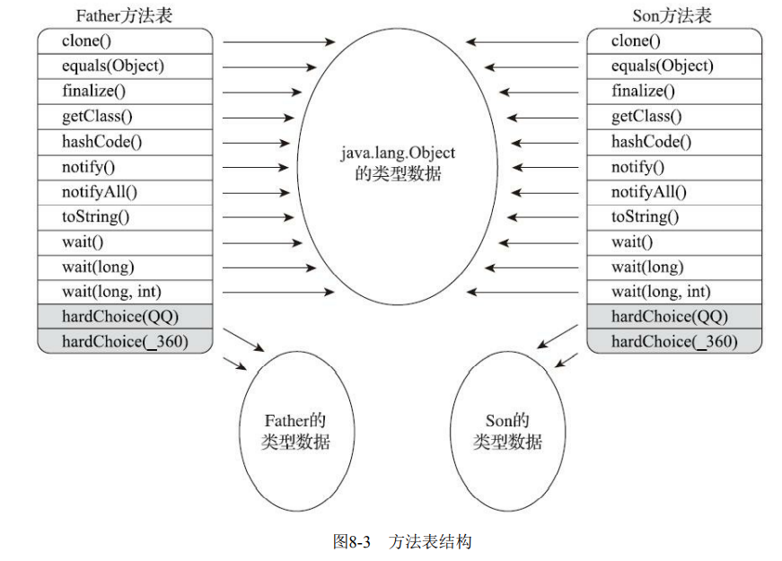

---
# 这是页面的图标
icon: page

# 这是文章的标题
title: 方法调用

# 设置作者
author: lllllan

# 设置写作时间
# time: 2020-01-20

# 一个页面只能有一个分类
category: Java

# 一个页面可以有多个标签
tag:
- JVM
- 深入理解Java虚拟机

# 此页面会在文章列表置顶
# sticky: true

# 此页面会出现在首页的文章板块中
star: true

# 你可以自定义页脚
# footer: 

---


::: warning 转载声明

- 《深入理解Java虚拟机》

:::


方法调用并不等同于方法中的代码被执行，方法调用阶段唯一的任务就是确定被调用方法的版本（即调用哪一个方法），暂时还未涉及方法内部的具体运行过程。


> Class文件的编译过程中不包含传统程序语言编译的连接步骤，一切方法调用在Class文件里面存储的都只是符号引用，而不是方法在实际运行时内存布局中的入口地址（也就是之前说的直接引用）。
>
> 这个特性给Java带来了更强大的动态扩展能力，但也使得Java方法调用过程变得相对复杂，某些调用需要在类加载期间，甚至到运行期间才能确定目标方法的直接引用


## 一、解析

所有方法调用的目标方法在Class文件里面都是一个常量池中的符号引用，在类加载的解析阶段，会将其中的一部分符号引用转化为直接引用，这种解析能够成立的前提是：方法在程序真正运行之前就有一个可确定的调用版本，并且这个方法的调用版本在运行期是不可改变的。 ==调用目标在程序代码写好、编译器进行编译那一刻就已经确定下来。== 这类方法的调用被称为解析。


### 1.1 编译期可知，运行期不可变

主要有静态方法和私有方法两大类，前者与类型直接关联，后者在外部不可被访问，这两种方法各自的特点决定了它们都不可能通过继承或别的方式重写出其他版本，因此它们都适合在类加载阶段进行解析


### 1.2 字节码指令

在Java虚拟机支持以下5条方法调用字 节码指令

- invokestatic。用于调用静态方法。 
- invokespecial。用于调用实例构造器()方法、私有方法和父类中的方法。 
- invokevirtual。用于调用所有的虚方法。 
- invokeinterface。用于调用接口方法，会在运行时再确定一个实现该接口的对象。 
- invokedynamic。先在运行时动态解析出调用点限定符所引用的方法，然后再执行该方法。前面4条调用指令，分派逻辑都固化在Java虚拟机内部，而invokedynamic指令的分派逻辑是由用户设定的引导方法来决定的。


::: info 虚方法

只要能被 `invokestatic` 和 `invokespecial` 指令调用的方法，都可以在解析阶段中确定唯一的调用版本， Java语言里符合这个条件的方法共有静态方法、私有方法、实例构造器、父类方法4种，再加上被final 修饰的方法（尽管它使用 `invokevirtual` 指令调用），这5种方法调用会在类加载的时候就可以把符号引用解析为该方法的直接引用。这些方法统称为【非虚方法】（Non-Virtual Method）。

与之相反，其他方 法就被称为【虚方法】（Virtual Method）。

:::


> Java中的非虚方法除了使用 `invokestatic` 、`invokespecial` 调用的方法之外还有一种，就是被 `final` 修饰的实例方法。虽然由于历史设计的原因，final 方法是使用 `invokevirtual` 指令来调用的，但是因为它也无法被覆盖，没有其他版本的可能，所以也无须对方法接收者进行多态选择，又或者说多态选择的结果肯定是唯一的。在《Java语言规范》中明确定义了被 final 修饰的方法是一种非虚方法。


### 1.3 解析调用

==解析调用一定是个静态的过程，在编译期间就完全确定== ，在类加载的解析阶段就会把涉及的符号引用全部转变为明确的直接引用，不必延迟到运行期再去完成。


## 二、分派

分派是区别于解析的另一种方法调用形式。它要更加复杂，可能是静态的也可能是动态的。


### 2.1 静态分派


重载代码示例：

```java
package org.fenixsoft.polymorphic;
/**
* 方法静态分派演示
* @author zzm
*/
public class StaticDispatch {
    static abstract class Human {
    }
    
    static class Man extends Human {
    }
    
    static class Woman extends Human {
    }
    
    public void sayHello(Human guy) {
        System.out.println("hello,guy!");
    }
    
    public void sayHello(Man guy) {
        System.out.println("hello,gentleman!");
    }
    
    public void sayHello(Woman guy) {
        System.out.println("hello,lady!");
    }
    
    public static void main(String[] args) {
        Human man = new Man();
        Human woman = new Woman();
        StaticDispatch sr = new StaticDispatch();
        sr.sayHello(man);
        sr.sayHello(woman);
    }
}
```


运行结果：

```java
hello,guy!
hello,guy!
```


我们把上面代码中的【Human】称为变量的 ==静态类型==（Static Type），或者叫 【外观类 型】（Apparent Type），后面的【Man】则被称为变量的 ==实际类型==（Actual Type）或者叫【运行时类型】（Runtime Type）。


静态类型和实际类型在程序中都可能会发生变化，区别是静态类型的变化仅仅在使用时发生，变量本身的静态类型不会被改变，并且最终的静态类型是在编译期可知的；而实际类型变化的结果在运行期才可确定，编译器在编译程序的时候并不知道一个对象的实际类型是什么


==重载是在编译时确定的==，由于静态类型在编译期可知，所以在编译阶段，Javac编译器就根据参数的静态类型决定了会使用哪个重载版本，因此选择了 `sayHello(Human)` 作为调用目标


### 2.2 动态分派


重写代码示例：

```java
package org.fenixsoft.polymorphic;
/**
* 方法动态分派演示
* @author zzm
*/
public class DynamicDispatch {
    static abstract class Human {
        protected abstract void sayHello();
    }
   
    static class Man extends Human {
        @Override
        protected void sayHello() {
            System.out.println("man say hello");
        }
    }
    
    static class Woman extends Human {
        @Override
        protected void sayHello() {
            System.out.println("woman say hello");
        }
    }
    
    public static void main(String[] args) {
        Human man = new Man();
        Human woman = new Woman();
        man.sayHello();
        woman.sayHello();
        man = new Woman();
        man.sayHello();
    }
}
```


运行结果：

```java
man say hello
woman say hello
woman say hello
```


==重写是在运行时确定的==，在确定了实际类型之后，才会选择对应的重写方法。


### 2.3 字段没有多态性

```java
package org.fenixsoft.polymorphic;
/**
* 字段不参与多态
* @author zzm
*/
public class FieldHasNoPolymorphic {
    static class Father {
        public int money = 1;
        
        public Father() {
            money = 2;
            showMeTheMoney();
        }
        
        public void showMeTheMoney() {
            System.out.println("I am Father, i have $" + money);
        }
    }
    
    static class Son extends Father {
        public int money = 3;
        
        public Son() {
            money = 4;
            showMeTheMoney();
        }
        
        public void showMeTheMoney() {
            System.out.println("I am Son, i have $" + money);
        }
    }
    
    public static void main(String[] args) {
        Father gay = new Son();
        System.out.println("This gay has $" + gay.money);
    }
}
```

```java
I am Son, i have $0
I am Son, i have $4
This gay has $2
```

1. 创建 Son 类的时候，首先隐式调用了父类 Father 的构造函数。而父类中存在对 `showMeTheMoney()` 的虚方法调用，实际执行的版本是 `Son::showMeTheMoney()`，但此时 Son 还没有进行初始化，因而使出了0
2. 之后 Son 在进行初始化的时候，才对自己的 money 赋值，调用 `showMeTheMoney()` 时输出了4
3. ==字段没有多态性==，因此直接或缺类中的字段，其实时通过静态类型访问到了父类中的 money，因此输出了2


### 2.4 单分派与多分派

方法的接收者与方法的参数统称为方法的宗量，根据分派基于多少种宗量，可以将分派划分为单分派和多分派两种。单分派是根据一个宗量对目标方法进行选择，多分派则是根据多于一个宗量对目标方法进行选择。


```java
/**
* 单分派、多分派演示
* @author zzm
*/
public class Dispatch {
    static class QQ {}
    
    static class _360 {}
    
    public static class Father {
        public void hardChoice(QQ arg) {
            System.out.println("father choose qq");
        }
    
        public void hardChoice(_360 arg) {
            System.out.println("father choose 360");
        }
    }
    
    public static class Son extends Father {
        public void hardChoice(QQ arg) {
            System.out.println("son choose qq");
        }
    
        public void hardChoice(_360 arg) {
            System.out.println("son choose 360");
        }
    }
    
    public static void main(String[] args) {
        Father father = new Father();
        Father son = new Son();
        father.hardChoice(new _360());
        son.hardChoice(new QQ());
    }
}
```


运行结果：

```java
father choose 360
son choose qq
```


> 在 `main()` 里调用了两次 `hardChoice()` 方法，这两次 `hardChoice()` 方法的选择结果在程序输出中已经显示得很清楚了。我们关注的首先是编译阶段中编译器的选择过程，也就是静态分派的过程。这时候选择目标方法的依据有两点：一是静态类型是【Father】还是【Son】，二是方法参数是【QQ】还是【360】。这次选择结 果的最终产物是产生了两条 `invokevirtual` 指令，两条指令的参数分别为常量池中指向 `Father::hardChoice(360)` 及 `Father::hardChoice(QQ)` 方法的符号引用。因为是根据两个宗量进行选择，所以 ==Java语言的静态分派属于多分派类型==。 
>
> 再看看运行阶段中虚拟机的选择，也就是动态分派的过程。在执行 `son.hardChoice(new QQ())` 这 行代码时，更准确地说，是在执行这行代码所对应的 `invokevirtual` 指令时，由于编译期已经决定目标方 法的签名必须为 `hardChoice(QQ)` ，虚拟机此时不会关心传递过来的参数【QQ】到底是“腾讯QQ”还是“奇瑞QQ”，因为这时候参数的静态类型、实际类型都对方法的选择不会构成任何影响，唯一可以影响虚 拟机选择的因素只有该方法的接受者的实际类型是【Father】还是【Son】。因为只有一个宗量作为选择依据， 所以 ==Java语言的动态分派属于单分派类型==


### 2.5 虚拟机动态分派的实现

动态分派的方法版本选择过程需要运行时在接收者类型的方法元数据中搜索合适的目标方法，因此，Java虚拟机实现基于执行性能的考虑，真正运行时一般不会如此频繁地去反复搜索类型元数据。


面对这种情况，一种基础而且常见的优化手段是为类型在方法区中建立一个【虚方法表】（Virtual Method Table，也称为vtable，与此对应的，在invokeinterface执行时也 会用到【接口方法表】——Interface Method Table，简称itable）




虚方法表中存放着各个方法的实际入口地址。如果某个方法在子类中没有被重写，那子类的虚方法表中的地址入口和父类相同方法的地址入口是一致的，都指向父类的实现入口。如果子类中重写了这个方法，子类虚方法表中的地址也会被替换为指向子类实现版本的入口地址。


为了程序实现方便，具有相同签名的方法，在父类、子类的虚方法表中都应当具有一样的索引序号，这样当类型变换时，仅需要变更查找的虚方法表，就可以从不同的虚方法表中按索引转换出所需的入口地址。虚方法表一般在类加载的连接阶段进行初始化，准备了类的变量初始值后，虚拟机会把 该类的虚方法表也一同初始化完毕。

