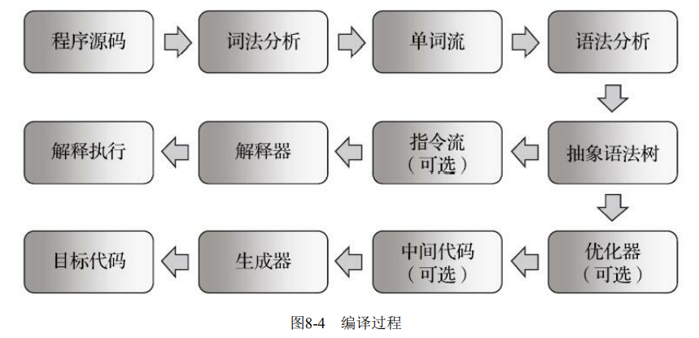
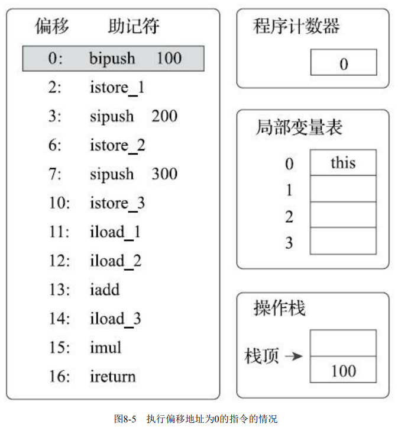
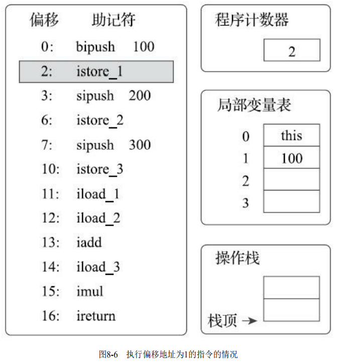
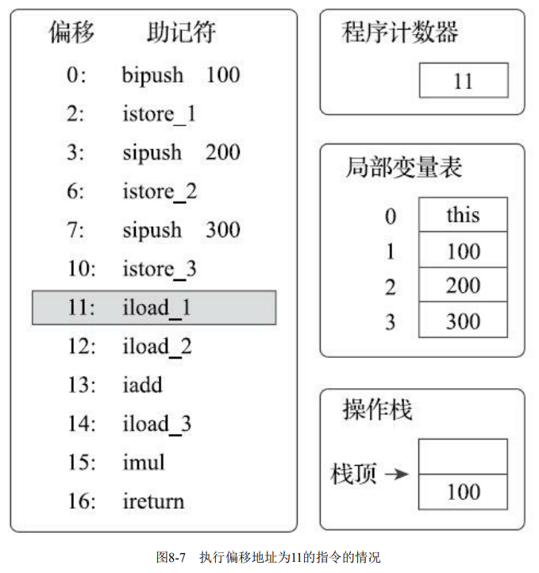
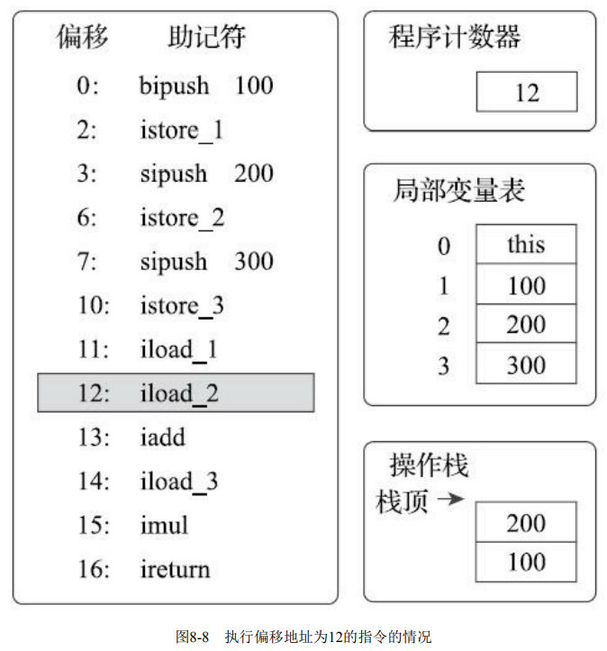
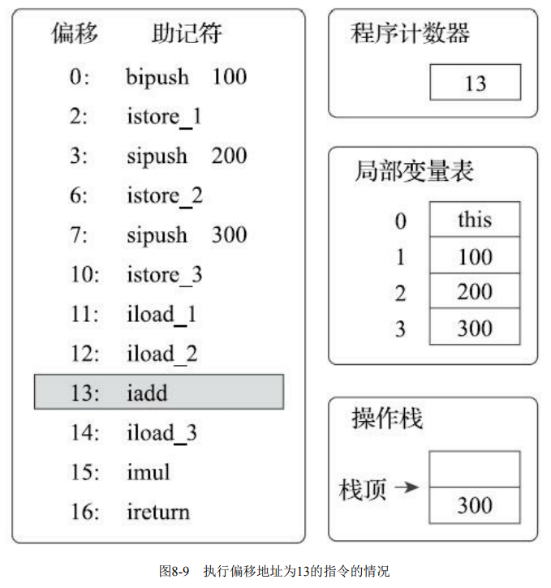
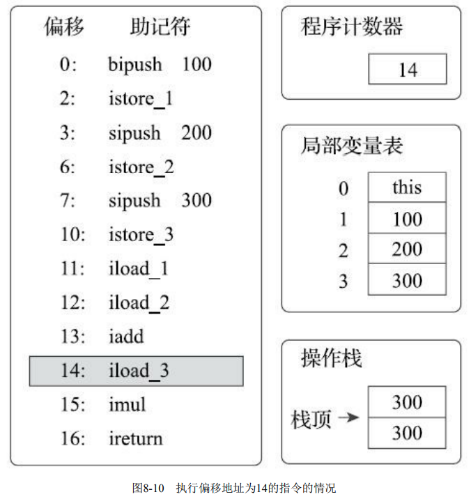
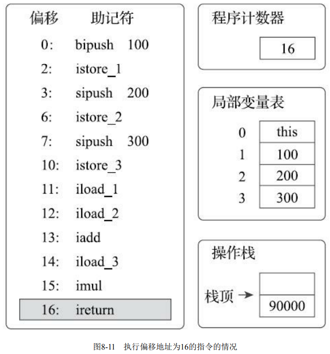

---
# 这是页面的图标
icon: page

# 这是文章的标题
title: 字节码解释执行引擎

# 设置作者
author: lllllan

# 设置写作时间
# time: 2020-01-20

# 一个页面只能有一个分类
category: Java

# 一个页面可以有多个标签
tag:
- JVM
- 深入理解Java虚拟机

# 此页面会在文章列表置顶
# sticky: true

# 此页面会出现在首页的文章板块中
star: true

# 你可以自定义页脚
# footer: 
---


::: warning 转载声明

- 《深入理解Java虚拟机》

:::


## 一、解释执行

> Java语言经常被人们定位为【解释执行】的语言，在Java初生的JDK 1.0时代，这种定义还算是比较准确的，但当主流的虚拟机中都包含了【即时编译器】后，Class文件中的代码到底会被解释执行还是编译执行，就成了只有虚拟机自己才能准确判断的事。


大部分的程序代码转换成物理机的目标代码或虚拟机能执行的指令集 之前，都需要经过图8-4中的各个步骤





在Java语言中，Javac 编译器完成了程序代码经过词法分析、语法分析到抽象语法树，再遍历语法树生成线性的字节码指令流的过程。因为这一部分动作是在Java虚拟机之外进行的，而解释器在虚拟机的内部，所以Java程序的编译就是半独立的实现。


## 二、基于栈的指令集和基于寄存器的指令集

Javac编译器输出的字节码指令流，基本上是一种【基于栈的指令集架构】（Instruction Set Architecture，ISA），字节码指令流里面的指令大部分都是零地址指令，它们依赖操作数栈进行工作。

与之相对的另外一套常用的指令集架构是【基于寄存器的指令集】，最典型的就是x86的二地址指令集，如果说得更通俗一些就是现在我们主流PC机中物理硬件直接支持的指令集架构，这些指令依赖寄 存器进行工作


举个最简单的例子，分别使用这两种指令集去计算【1+1】的结果：

:::: code-group


::: code-group-item 基于栈的指令集

```shell
iconst_1
iconst_1
iadd
istore_0
```

两条 `iconst_1` 指令连续把两个常量1压入栈后，iadd指令把栈顶的两个值出栈、相加，然后把结果放回栈顶，最后 `istore_0` 把栈顶的值放到局部变量表的第0个变量槽中。这种指令流中的指令通常都是不带参数的，使用操作数栈中的数据作为指令的运算输入，指令的运算结果也存储在操作数栈之中。

:::


::: code-group-item 基于寄存器的指令集

```shell
mov eax, 1
add eax, 1
```

mov指令把EAX寄存器的值设为1，然后add指令再把这个值加1，结果就保存在EAX寄存器里面。 这种二地址指令是x86指令集中的主流，每个指令都包含两个单独的输入参数，依赖于寄存器来访问和存储数据。

:::


::::


::: tip 两种指令集各自的优缺

**基于栈的指令集：**

- 可以自由地把访问最频繁的数据放到寄存去中获取尽量好的性能
- 代码相对更加紧凑、编译器实现更加简单
- 由于指令数量和内存访问的原因，执行速度略慢


---


**基于寄存器的指令集：**

- 不可能避免地要受到硬件的约束
- 直接依赖寄存及，理论上执行速度更快

:::


## 三、基于栈的解释器执行过程

```java
public int calc() {
    int a = 100;
    int b = 200;
    int c = 300;
    return (a + b) * c;
}
```


```javac
public int calc();
	Code:
		Stack=2, Locals=4, Args_size=1
        0: bipush 100
		2: istore_1
		3: sipush 200
		6: istore_2
		7: sipush 300
		10: istore_3
		11: iload_1
		12: iload_2
		13: iadd
		14: iload_3
		15: imul
		16: ireturn
}
```


### 0

首先，执行偏移地址为0的指令，Bipush指令的作用是将单字节的整型常量值（-128～127）推入操作数栈顶，跟随有一个参数，指明推送的常量值，这里是100




### 1

执行偏移地址为2的指令，`istore_1` 指令的作用是将操作数栈顶的整型值出栈并存放到第1个局部变量槽中。后续4条指令（直到偏移为11的指令为止）都是做一样的事情，也就是在对应代码中把变量 a、b、c赋值为100、200、300。这4条指令的图示略过。




### 2

执行偏移地址为11的指令，iload_1指令的作用是将局部变量表第1个变量槽中的整型值复制到操作数栈顶。




### 3

执行偏移地址为12的指令，iload_2指令的执行过程与iload_1类似，把第2个变量槽的整型值入栈。 画出这个指令的图示主要是为了显示下一条iadd指令执行前的堆栈状况。




### 4

执行偏移地址为13的指令，`iadd` 指令的作用是将操作数栈中头两个栈顶元素出栈，做整型加法，然后把结果重新入栈。在iadd指令执行完毕后，栈中原有的100和200被出栈，它们的和300被重新入栈。




### 5

执行偏移地址为14的指令，`iload_3` 指令把存放在第3个局部变量槽中的300入栈到操作数栈中。这时操作数栈为两个整数300。下一条指令imul是将操作数栈中头两个栈顶元素出栈，做整型乘法，然后把结果重新入栈，与iadd完全类似




### 6

执行偏移地址为16的指令，ireturn指令是方法返回指令之一，它将结束方法执行并将操作数栈顶的整型值返回给该方法的调用者。到此为止，这段方法执行结束


