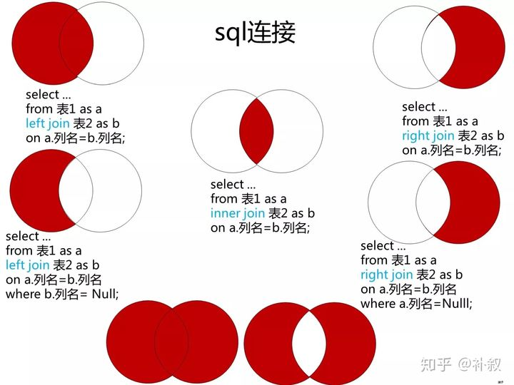

---
# 这是页面的图标
icon: page

# 这是文章的标题
title: MySQL 面试题合集

# 设置作者
author: lllllan

# 设置写作时间
# time: 2020-01-20

# 一个页面只能有一个分类
category: 数据库

# 一个页面可以有多个标签
tag:

# 此页面会在文章列表置顶
# sticky: true

# 此页面会出现在首页的文章板块中
star: true

# 你可以自定义页脚
# footer: 
---

::: warning 转载自一下文章，略有改动

- [SQL：多表查询](https://zhuanlan.zhihu.com/p/91973413)
- [MySQL中的悲观锁](https://www.jianshu.com/p/8a70a4af7eac)
- [什么是乐观锁，什么是悲观锁 - 简书 (jianshu.com)](https://www.jianshu.com/p/d2ac26ca6525)
- [数据库——彻底明白超键、候选键、主键、外键](https://blog.csdn.net/jerry11112/article/details/78160771)

:::

## 数据库【常识】

### 数据三范式

1. 第一范式：属性不可再分
2. 第二范式：第一范式基础上，消除了非主属性对于码的部分函数依赖
3. 第三范式，第二范式基础上，消除了非主属性对于码的传递函数依赖

## MySQL 存储引擎及使用场景

### 什么是存储引擎

**数据库引擎是数据库 ==底层软件组织==**

MySQL中的数据用各种不同的技术存储在文件（或者内存）中。这些技术中的每一种技术都使用不同的存储机制、索引技巧、锁定水平并且最终提供广泛的不同的功能和能力。通过选择不同的技术，你能够获得额外的速度或者功能，从而改善你的应用的整体功能。

### MySQL 各种存储引擎

|     功能     | MyISAM  | MEMORY  |   InnoDB   | Archive |
| :----------: | :-----: | :-----: | :--------: | :-----: |
|   存储限制   |  256TB  |   RAM   |    64TB    |  None   |
|   支持事务   |   No    |   No    |  ==Yes==   |   No    |
| 支持全文索引 | ==Yes== |   No    |     No     |   No    |
|  支持树索引  |   Yes   |   Yes   |    Yes     |   No    |
| 支持哈希索引 |   No    | ==Yes== |     No     |   No    |
| 支持数据缓存 |   No    |   N/A   |  ==Yes==   |   No    |
|   支持外键   |   No    |   No    |  ==Yes==   |   No    |
|      锁      | 全表锁  | 全表锁  | ==行级锁== |         |

### 存储引擎的选择

1. 如果需要提供提交、回滚和恢复的 ==事务安全== 能力，并要求 ==并发控制==  → InnoDB
2. 如果数据表主要用来 ==插入和查询== 记录 → MyISAM
3. 如果只是临时存放数据，==数据量不大==，并且**不需要提高数据的安全性** → MEMORY
4. 如果 ==只有插入和查询== → Archive，支持高并发的插入，但是非事务安全

### MyISAM 和 InnoDB 的区别

**区别：**

1. InnoDB 支持事务，MyISAM 不支持事务。这是 MySQL 将默认存储引擎从 MyISAM 编程的 InnoDB 的重要原因之一。
2. InnoDB 支持外键，MyISAM 不支持。
3. InnoDB 是聚集索引，MyISAM 是非聚集索引。
4. InnoDB 不保存表的具体行数，执行 `select count(*) from table` 需要全表扫描。 而 MyISAM 用一个变量保存了整个表的行数，查询行数时速度更快。
5. InnoDB 最小的锁粒度是行锁，MyISAM 最小的锁粒度是表锁。一个更新语句会锁住整张表，导致其他查询和更新都会被阻塞，因此并发访问受限。

**如何选择：**

1. 需要支持事务，InnoDB
2. 主要是查询工作，MyISAM；如果读写也频繁，InnoDB
3. MyISAM 系统崩溃后恢复更困难

## 关键字

### drop、delete、truncate

- drop 丢弃数据：`drop table`，直接删除表
- truncate 清空数据：`truncate table`，值删除表中的数据，再插入数据时自增id又从1开始
- delete 删除数据：`delete from table where ?`，删除某一列的数据

::: note 执行速度

一般来说：drop > truncate > delete

- `delete`命令执行的时候会产生数据库的`binlog`日志，而日志记录是需要消耗时间的，但是也有个好处方便数据回滚恢复。
- `truncate`命令执行的时候不会产生数据库日志，因此比`delete`要快。除此之外，还会把表的自增值重置和索引恢复到初始大小等。
- `drop`命令会把表占用的空间全部释放掉。

 :::

### varchar 和 char 的区别

- char 固定长度，加入申请了 `char(10)` ，那么无论实际存储多少内容，该字段都占用了10个字符
- varchr 是变长，申请的只是最大长度，占用的控件时实际的字符长度+1

从效率角度 `char > varchar` ，因此使用中如果确定某字段值的长度，可以使用 char，否则应该尽量使用 varchar

###  varchar(10) 和 int(10)

varchar的10代表了申请的空间长度,也是可以存储的数据的最大长度,而int的10只是代表了展示的长度,不足10位以0填充.也就是说,int(1)和int(10)所能存储的数字大小以及占用的空间都是相同的,只是在展示时按照长度展示.

## 查询

## 锁

[【MySQL】MySQL中的锁机制 - 周二鸭 - 博客园 (cnblogs.com)](https://www.cnblogs.com/jojop/p/13982679.html)
