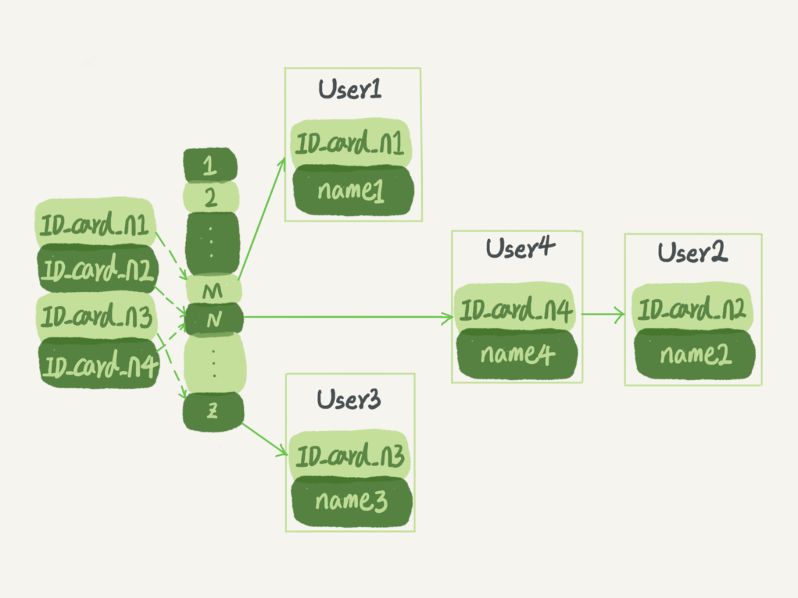
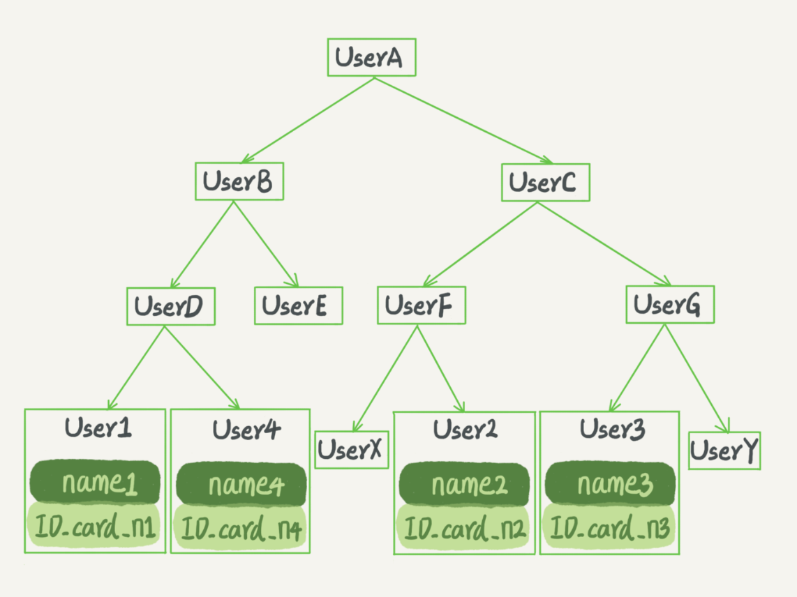
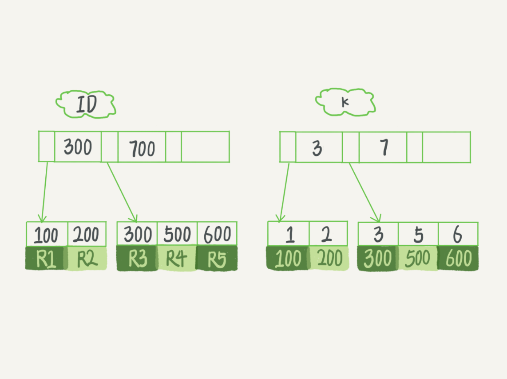

---

# 这是页面的图标
icon: page

# 这是文章的标题
title: 索引

# 设置作者
author: lllllan

# 设置写作时间
# time: 2020-01-20

# 一个页面只能有一个分类
category: 数据库

# 一个页面可以有多个标签
tag:

# 此页面会在文章列表置顶
# sticky: true

# 此页面会出现在首页的文章板块中
star: true

# 你可以自定义页脚
# footer: 


---


::: warning 转载声明

- [MySQL实战45讲 (gitee.io)](https://funnylog.gitee.io/mysql45/iframe/)

:::


索引的出现其实就是为了提高数据查询的效率，就像书的目录一样。一本500页的书，如果你想快速找到其中的某一个知识点，在不借助目录的情况下，那我估计你可得找一会儿。同样，对于数据库的表而言，索引其实就是它的“目录”。


## 一、索引的常见模型


索引的常见模型有：哈希表、有序数组、搜索树。


### 1.1 哈希表

哈希表是一种以键-值（key-value）存储数据的结构，我们只要输入待查找的值即key，就可以找到其对应的值即Value。哈希的思路很简单，把值放在数组里，用一个哈希函数把key换算成一个确定的位置，然后把value放在数组的这个位置。


不可避免地，多个key值经过哈希函数的换算，会出现同一个值的情况。处理这种情况的一种方法是，拉出一个链表。

假设，你现在维护着一个身份证信息和姓名的表，需要根据身份证号查找对应的名字，这时对应的哈希索引的示意图如下所示：




图中，User2和User4根据身份证号算出来的值都是N，但没关系，后面还跟了一个链表。假设，这时候你要查ID_card_n2对应的名字是什么，处理步骤就是：首先，将ID_card_n2通过哈希函数算出N；然后，按顺序遍历，找到User2。

需要注意的是，图中四个ID_card_n的值并不是递增的，这样做的好处是增加新的User时速度会很快，只需要往后追加。但缺点是，因为不是有序的，所以哈希索引做区间查询的速度是很慢的。

你可以设想下，如果你现在要找身份证号在[ID_card_X, ID_card_Y]这个区间的所有用户，就必须全部扫描一遍了。

所以，**哈希表这种结构适用于只有等值查询的场景**，比如Memcached及其他一些NoSQL引擎。


### 1.2 有序数组

**有序数组在等值查询和范围查询场景中的性能就都非常优秀**。还是上面这个根据身份证号查名字的例子，如果我们使用有序数组来实现的话，示意图如下所示：


这里我们假设身份证号没有重复，这个数组就是按照身份证号递增的顺序保存的。这时候如果你要查ID_card_n2对应的名字，用二分法就可以快速得到，这个时间复杂度是O(log(N))。

同时很显然，这个索引结构支持范围查询。你要查身份证号在[ID_card_X, ID_card_Y]区间的User，可以先用二分法找到ID_card_X（如果不存在ID_card_X，就找到大于ID_card_X的第一个User），然后向右遍历，直到查到第一个大于ID_card_Y的身份证号，退出循环。

如果仅仅看查询效率，有序数组就是最好的数据结构了。但是，在需要更新数据的时候就麻烦了，你往中间插入一个记录就必须得挪动后面所有的记录，成本太高。

所以，**有序数组索引只适用于静态存储引擎**，比如你要保存的是2017年某个城市的所有人口信息，这类不会再修改的数据。


### 1.3 搜索树

二叉搜索树的特点是：每个节点的左儿子小于父节点，父节点又小于右儿子。这样如果你要查ID_card_n2的话，按照图中的搜索顺序就是按照UserA -> UserC -> UserF -> User2这个路径得到。这个时间复杂度是O(log(N))。

当然为了维持O(log(N))的查询复杂度，你就需要保持这棵树是平衡二叉树。为了做这个保证，更新的时间复杂度也是O(log(N))。



树可以有二叉，也可以有多叉。多叉树就是每个节点有多个儿子，儿子之间的大小保证从左到右递增。二叉树是搜索效率最高的，但是实际上大多数的数据库存储却并不使用二叉树。其原因是，索引不止存在内存中，还要写到磁盘上。

你可以想象一下一棵100万节点的平衡二叉树，树高20。一次查询可能需要访问20个数据块。在机械硬盘时代，从磁盘随机读一个数据块需要10 ms左右的寻址时间。也就是说，对于一个100万行的表，如果使用二叉树来存储，单独访问一个行可能需要20个10 ms的时间，这个查询可真够慢的。

为了让一个查询尽量少地读磁盘，就必须让查询过程访问尽量少的数据块。那么，我们就不应该使用二叉树，而是要使用“N叉”树。这里，“N叉”树中的“N”取决于数据块的大小。


以InnoDB的一个整数字段索引为例，这个N差不多是1200。这棵树高是4的时候，就可以存1200的3次方个值，这已经17亿了。考虑到树根的数据块总是在内存中的，一个10亿行的表上一个整数字段的索引，查找一个值最多只需要访问3次磁盘。其实，树的第二层也有很大概率在内存中，那么访问磁盘的平均次数就更少了。

N叉树由于在读写上的性能优点，以及适配磁盘的访问模式，已经被广泛应用在数据库引擎中了。

不管是哈希还是有序数组，或者N叉树，它们都是不断迭代、不断优化的产物或者解决方案。数据库技术发展到今天，跳表、LSM树等数据结构也被用于引擎设计中，这里我就不再一一展开了。


## 二、InnoDB的索引模型

在InnoDB中，表都是根据主键顺序以索引的形式存放的，这种存储方式的表称为索引组织表。InnoDB使用了B+树索引模型，所以数据都是存储在B+树中的。


### 2.1 B+树


每一个索引在InnoDB里面对应一棵B+树。

假设，我们有一个主键列为ID的表，表中有字段k，并且在k上有索引。

这个表的建表语句是：

```mysql
create table T(
    id int primary key, 
    k int not null, 
    name varchar(16),
    index (k)
)engine=InnoDB;
```


表中R1~R5的(ID,k)值分别为(100,1)、(200,2)、(300,3)、(500,5)和(600,6)，两棵树的示例示意图如下。


从图中不难看出，根据叶子节点的内容，索引类型分为主键索引和非主键索引。

主键索引的叶子节点存的是整行数据。在InnoDB里，主键索引也被称为 ==聚簇索引==（clustered index）。

非主键索引的叶子节点内容是主键的值。在InnoDB里，非主键索引也被称为 ==二级索引==（secondary index）。


::: tip 基于主键索引和普通索引的查询有什么区别？

- 如果语句是 `select * from T where ID = 500`，即主键查询方式，则只需要搜索ID这棵B+树；
- 如果语句是 `select * from T where k = 5`，即普通索引查询方式，则需要先搜索k索引树，得到ID的值为500，再到ID索引树搜索一次。这个过程称为回表。


也就是说，基于非主键索引的查询需要多扫描一棵索引树。因此，我们在应用中应该尽量使用主键查询。

:::


### 2.2 索引维护

B+树为了维护索引有序性，在插入新值的时候需要做必要的维护。以上面这个图为例，如果插入新的行ID值为700，则只需要在R5的记录后面插入一个新记录。如果新插入的ID值为400，就相对麻烦了，需要逻辑上挪动后面的数据，空出位置。

而更糟的情况是，如果R5所在的数据页已经满了，根据B+树的算法，这时候需要申请一个新的数据页，然后挪动部分数据过去。这个过程称为 ==页分裂== 。在这种情况下，性能自然会受影响。

除了性能外，页分裂操作还影响数据页的利用率。原本放在一个页的数据，现在分到两个页中，整体空间利用率降低大约50%。

当然有分裂就有合并。当相邻两个页由于删除了数据，利用率很低之后，会将数据页做合并。合并的过程，可以认为是分裂过程的逆过程。


### 2.3 主键的选择

基于上面的索引维护过程说明，我们来讨论一个案例：

> 你可能在一些建表规范里面见到过类似的描述，要求建表语句里一定要有自增主键。当然事无绝对，我们来分析一下哪些场景下应该使用自增主键，而哪些场景下不应该。


**适合用自增主键的场景：**

自增主键是指自增列上定义的主键，在建表语句中一般是这么定义的： `NOT NULL PRIMARY KEY AUTO_INCREMENT`。

插入新记录的时候可以不指定ID的值，系统会获取当前ID最大值加1作为下一条记录的ID值。

也就是说，自增主键的插入数据模式，正符合了我们前面提到的递增插入的场景。每次插入一条新记录，都是追加操作，都不涉及到挪动其他记录，也不会触发叶子节点的分裂。

而有业务逻辑的字段做主键，则往往不容易保证有序插入，这样写数据成本相对较高。

除了考虑性能外，我们还可以从存储空间的角度来看。假设你的表中确实有一个唯一字段，比如字符串类型的身份证号，那应该用身份证号做主键，还是用自增字段做主键呢？

由于每个非主键索引的叶子节点上都是主键的值。如果用身份证号做主键，那么每个二级索引的叶子节点占用约20个字节，而如果用整型做主键，则只要4个字节，如果是长整型（bigint）则是8个字节。

**显然，主键长度越小，普通索引的叶子节点就越小，普通索引占用的空间也就越小。**

---


**适合业务字段做主键的场景：**

1. 只有一个索引；
2. 该索引必须是唯一索引。

你一定看出来了，这就是典型的KV场景。

由于没有其他索引，所以也就不用考虑其他索引的叶子节点大小的问题。

这时候我们就要优先考虑上一段提到的【尽量使用主键查询】原则，直接将这个索引设置为主键，可以避免每次查询需要搜索两棵树。


### 2.4 回表


在下面这个表T中，如果我执行 `select * from T where k between 3 and 5`，需要执行几次树的搜索操作，会扫描多少行？

下面是这个表的初始化语句。

```mysql
create table T (
    ID int primary key,
    k int NOT NULL DEFAULT 0, 
    s varchar(16) NOT NULL DEFAULT '',
    index k(k)
)engine=InnoDB;

insert into T values(100,1, 'aa'),(200,2,'bb'),(300,3,'cc'),(500,5,'ee'),(600,6,'ff'),(700,7,'gg');
```





现在，我们一起来看看这条SQL查询语句的执行流程：

1. 在k索引树上找到k=3的记录，取得 ID = 300；
2. 再到ID索引树查到ID=300对应的R3；
3. 在k索引树取下一个值k=5，取得ID=500；
4. 再回到ID索引树查到ID=500对应的R4；
5. 在k索引树取下一个值k=6，不满足条件，循环结束。

在这个过程中，**回到主键索引树搜索的过程，我们称为回表**。可以看到，这个查询过程读了k索引树的3条记录（步骤1、3和5），回表了两次（步骤2和4）。

在这个例子中，由于查询结果所需要的数据只在主键索引上有，所以不得不回表。那么，有没有可能经过索引优化，避免回表过程呢？


### 2.5 覆盖索引

如果执行的语句是 `select ID from T where k between 3 and 5`，这时只需要查ID的值，而ID的值已经在k索引树上了，因此可以直接提供查询结果，不需要回表。也就是说，在这个查询里面，索引k已经【覆盖了】我们的查询需求，我们称为覆盖索引。


**由于覆盖索引可以减少树的搜索次数，显著提升查询性能，所以使用覆盖索引是一个常用的性能优化手段。**


需要注意的是，在引擎内部使用覆盖索引在索引k上其实读了三个记录，R3~R5（对应的索引k上的记录项），但是对于MySQL的Server层来说，它就是找引擎拿到了两条记录，因此MySQL认为扫描行数是2。


### 2.6 联合索引

基于上面覆盖索引的说明，我们来讨论一个问题：**在一个市民信息表上，是否有必要将身份证号和名字建立联合索引？**

假设这个市民表的定义是这样的：

```mysql
CREATE TABLE `tuser` (
    `id` int(11) NOT NULL,
    `id_card` varchar(32) DEFAULT NULL,
    `name` varchar(32) DEFAULT NULL,
    `age` int(11) DEFAULT NULL,
    `ismale` tinyint(1) DEFAULT NULL,
    PRIMARY KEY (`id`),
    KEY `id_card` (`id_card`),
    KEY `name_age` (`name`,`age`)
) ENGINE=InnoDB
```

我们知道，身份证号是市民的唯一标识。也就是说，如果有根据身份证号查询市民信息的需求，我们只要在身份证号字段上建立索引就够了。而再建立一个（身份证号、姓名）的联合索引，是不是浪费空间？

如果现在有一个高频请求，要根据市民的身份证号查询他的姓名，这个联合索引就有意义了。它可以在这个高频请求上用到覆盖索引，不再需要回表查整行记录，减少语句的执行时间。

当然，索引字段的维护总是有代价的。因此，在建立冗余索引来支持覆盖索引时就需要权衡考虑了。这正是业务DBA，或者称为业务数据架构师的工作。


### 2.7 最左前缀原则

看到这里你一定有一个疑问，如果为每一种查询都设计一个索引，索引是不是太多了。如果我现在要按照市民的身份证号去查他的家庭地址呢？虽然这个查询需求在业务中出现的概率不高，但总不能让它走全表扫描吧？反过来说，单独为一个不频繁的请求创建一个（身份证号，地址）的索引又感觉有点浪费。应该怎么做呢？

这里，我先和你说结论吧。**B+树这种索引结构，可以利用索引的“最左前缀”，来定位记录。**

为了直观地说明这个概念，我们用（name，age）这个联合索引来分析。


可以看到，索引项是按照索引定义里面出现的字段顺序排序的。

当你的逻辑需求是查到所有名字是“张三”的人时，可以快速定位到ID4，然后向后遍历得到所有需要的结果。

如果你要查的是所有名字第一个字是“张”的人，你的SQL语句的条件是 `where name like ‘张%’`。这时，你也能够用上这个索引，查找到第一个符合条件的记录是ID3，然后向后遍历，直到不满足条件为止。

可以看到，不只是索引的全部定义，只要满足最左前缀，就可以利用索引来加速检索。这个最左前缀可以是联合索引的最左N个字段，也可以是字符串索引的最左M个字符。

基于上面对最左前缀索引的说明，我们来讨论一个问题：**在建立联合索引的时候，如何安排索引内的字段顺序。**

这里我们的评估标准是，索引的复用能力。因为可以支持最左前缀，所以当已经有了(a,b)这个联合索引后，一般就不需要单独在a上建立索引了。因此，**第一原则是，如果通过调整顺序，可以少维护一个索引，那么这个顺序往往就是需要优先考虑采用的。**

所以现在你知道了，这段开头的问题里，我们要为高频请求创建(身份证号，姓名）这个联合索引，并用这个索引支持“根据身份证号查询地址”的需求。

那么，如果既有联合查询，又有基于a、b各自的查询呢？查询条件里面只有b的语句，是无法使用(a,b)这个联合索引的，这时候你不得不维护另外一个索引，也就是说你需要同时维护(a,b)、(b) 这两个索引。

这时候，我们要**考虑的原则就是空间**了。比如上面这个市民表的情况，name字段是比age字段大的 ，那我就建议你创建一个（name,age)的联合索引和一个(age)的单字段索引。


### 2.8 索引下推

上一段我们说到满足最左前缀原则的时候，最左前缀可以用于在索引中定位记录。这时，你可能要问，那些不符合最左前缀的部分，会怎么样呢？

我们还是以市民表的联合索引（name, age）为例。如果现在有一个需求：检索出表中“名字第一个字是张，而且年龄是10岁的所有男孩”。那么，SQL语句是这么写的：

```mysql
mysql> select * from tuser where name like '张%' and age = 10 and ismale = 1;
```

你已经知道了前缀索引规则，所以这个语句在搜索索引树的时候，只能用 “张”，找到第一个满足条件的记录ID3。当然，这还不错，总比全表扫描要好。

然后呢？

当然是判断其他条件是否满足。

在MySQL 5.6之前，只能从ID3开始一个个回表。到主键索引上找出数据行，再对比字段值。

而MySQL 5.6 引入的索引下推优化（index condition pushdown)， 可以在索引遍历过程中，对索引中包含的字段先做判断，直接过滤掉不满足条件的记录，减少回表次数。

图3和图4，是这两个过程的执行流程图。


图3：无索引下推执行流程


图4：索引下推执行流程


在图3和4这两个图里面，每一个虚线箭头表示回表一次。

图3中，在(name,age)索引里面我特意去掉了age的值，这个过程InnoDB并不会去看age的值，只是按顺序把“name第一个字是’张’”的记录一条条取出来回表。因此，需要回表4次。

图4跟图3的区别是，InnoDB在(name,age)索引内部就判断了age是否等于10，对于不等于10的记录，直接判断并跳过。在我们的这个例子中，只需要对ID4、ID5这两条记录回表取数据判断，就只需要回表2次。


## 三、索引类型

[通俗易懂 索引、单列索引、复合索引、主键、唯一索引、聚簇索引、非聚簇索引、唯一聚簇索引 的区别与联系 - 知乎 (zhihu.com)](https://zhuanlan.zhihu.com/p/66553466)
