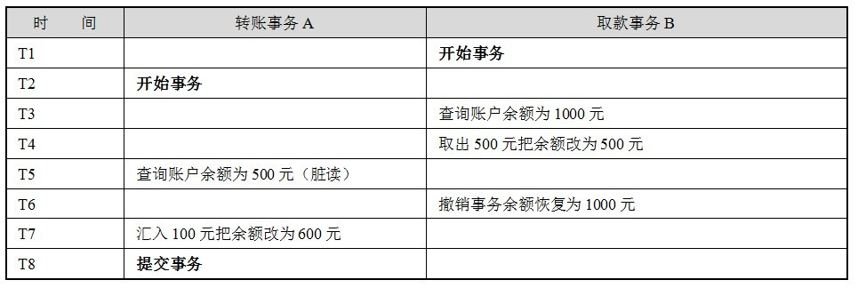
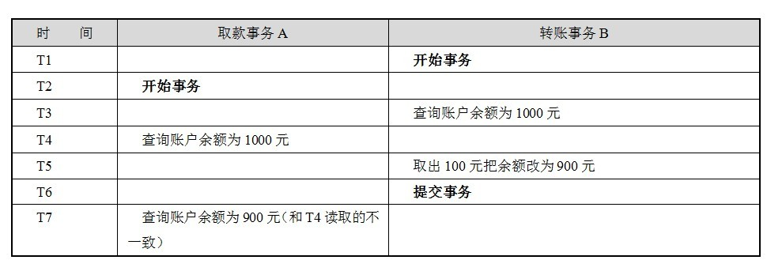

---
# 这是页面的图标
icon: page

# 这是文章的标题
title: 事务

# 设置作者
author: lllllan

# 设置写作时间
# time: 2020-01-20

# 一个页面只能有一个分类
category: 数据库

# 一个页面可以有多个标签
tag:

# 此页面会在文章列表置顶
# sticky: true

# 此页面会出现在首页的文章板块中
star: true

# 你可以自定义页脚
# footer: 


---


::: warning 转载声明

- [MySQL实战45讲 (gitee.io)](https://funnylog.gitee.io/mysql45/iframe/)
- [MySQL事务【详解-最新的总结】](https://blog.csdn.net/wang_luwei/article/details/119619105)
- [MySQL事务 - 简书 (jianshu.com)](https://www.jianshu.com/p/081a3e208e32)
- [MySQL 事务 | 菜鸟教程 (runoob.com)](https://www.runoob.com/mysql/mysql-transaction.html)
- [事务并发的问题](https://blog.csdn.net/dingguanyi/article/details/80888441)
- [MySQL事务隔离级别和实现原理](https://zhuanlan.zhihu.com/p/117476959)

:::


## 什么是事务


::: info 事务

是指对数据库执行一批操作，在同一个事务当中，这些操作最终要么全部执行成功，要么全部失败，不会存在部分成功的情况。

:::


- 事务是一个原子操作。是一个最小执行单元。可以甶一个或多个SQL语句组成
- 在同一个事务当中，所有的SQL语句都成功执行时，整 个事务成功，有一个SQL语句执行失败，整个事务都执行失败。


## 事务四大特征


### 原子性

原子性（**A**tomicity，或称不可分割性）

一个事务（transaction）中的所有操作，要么全部完成，要么全部不完成，不会结束在中间某个环节。事务在执行过程中发生错误，会被回滚（Rollback）到事务开始前的状态，就像这个事务从来没有执行过一样


::: warning 回滚？

:::

---


### 一致性

一致性（**C**onsistency）

在事务开始之前和事务结束以后，数据库的完整性没有被破坏。这表示写入的资料必须完全符合所有的预设规则，这包含资料的精确度、串联性以及后续数据库可以自发性地完成预定的工作。

> 例如从帐户A转一笔钱到帐户B上，如果帐户A上的钱减少了，而帐户B上的钱却没有增加，那么我们认为此时数据处于不一致的状态。

---


### 隔离性

隔离性（**I**solation，又称独立性）

数据库允许多个并发事务同时对其数据进行读写和修改的能力，隔离性可以防止多个事务并发执行时由于交叉执行而导致数据的不一致。

事务隔离分为不同级别，包括读未提交（Read uncommitted）、读提交（read committed）、可重复读（repeatable read）和串行化（Serializable）

---


### 持久性

持久性（**D**urability）

事务处理结束后，对数据的修改就是永久的，即便系统故障也不会丢失


## 事务并发的问题

一个数据库可能拥有多个访问客户端，这些客户端都可以并发方式访问数据库。数据库中的相同数据可能同时被多个事务访问，如果没有采取必要的隔离措施，就会导致各种并发问题，破坏数据的完整性。

这些问题可以归结为5类，包括3类数据读问题（ 脏读、 不可重复读和幻象读）以及2类数据更新问题（两类丢失更新）


### 脏读

**因为事务的撤销，导致另一事务读到了提交以前的脏数据。**

脏读又称无效数据的读出，是指在数据库访问中，事务T1将某一值修改，然后事务T2读取该值，此后T1因为某种原因撤销对该值的修改，这就导致了T2所读取到的数据是无效的，值得注意的是，脏读一般是针对于update操作的。




### 不可重复度

**因为事务的提交修改了数据，导致另一事务的前后两次查询得到了不同的结果。**




### 幻读

**因为事务的提交增删了数据，导致另一事务的前后两次查询得到了不同的结果**


::: tip

**不可重复读** ，是因为 `update` 操作，导致某个事务的前后两次查询，得到了不一致的结果。


**幻读** ，是因为 `insert, delete` 操作，导致某个事务的第二次查询比前一次查询多了或少了某条数据

:::


### 丢失更新

**因为事务的撤销，覆盖了另一事务的修改**


**因为事务的提交，覆盖了另一事务的修改**


## 事务隔离级别

- 读未提交：read uncommitted
- 读已提交：read committed
- 可重复读：repeatable read
- 串行化：serializable


### 读未提交

==读未提交不加锁==，没有隔离，因此性能最好。


::: center


:::


::: info 事务能够读到另一事务提交以前所修改的数据 

:::

::: danger 脏读、不可重复读、幻读

:::


### 读已提交

==MVCC - 每个 select 语句都有自己的一份快照==，而不是一个事务一份，所以在不同的时刻，查询出来的数据可能是不一致的

> 快照：读取的记录数据是可见版本（含久版本）


::: center


:::


::: info 解决了脏读。事务只能读到其他事务提交以后的数据

:::

::: danger  不可重复读、幻读

:::


### 可重复读

==MVCC - 一次事务只在第一次 select 时生成快照== 


::: center


:::


::: info 事务范围内如果有其他事务提交，必须自己也提交事务后才能读取到该结果。

MVCC 解决了不可重复读

- MySQL的快照读，[MVCC](../mvcc/)避免了幻读
- MySQL的当前读，[next-key 锁](../next-key-lock/)解决了幻读

:::


### 串行化

==串行化可以并发读，但是在写的时候加排他锁==，其他事务不能并发写也不能在某个事务写的时候去并发读。


::: info 解决了所有问题

:::


::: danger 性能最差

:::


## 事务操作


### 显式事务

事务需要手动开启、提交或回滚，由开发者自己控制。


**手动开启事务**

```mysql
mysql> start transaction;
```


**执行语句**

```mysql
mysql> update ...
```


**提交事务**

```mysql
mysql> commit;
```


**回滚事务**

```mysql
mysql> rollback;
```


### 隐式事务

事务自动开启、提交或回滚，比如insert、update、delete语句，事务的开启、提交或回滚由mysql内部自动控制的。
